# **STATe-of-Thoughts: Structured Action Templates for Tree-of-Thoughts**

_**Note**: This is a preliminary preview, a full release will come soon. Please refer to LICENSE.txt for the licensing of this preview._

**dspy-reasoning** is a modular framework that implements **STATe-of-Thoughts (Structured Action Templates for Tree-of-Thoughts)**. It is a method for inference-time compute that augments beam search with targeted interventions (tools) to modulate reasoning trajectories (influencing latent properties of reasoning steps like structure, style, and content).

Built on [DSPy](https://github.com/stanfordnlp/dspy) and [vLLM](https://github.com/vllm-project/vllm), this framework enables local Large Language Models (LLMs) to perform systematic exploration of reasoning trajectories, evaluate intermediate steps (process supervision), and select optimal trajectories for complex tasks like argumentation, creative writing, and math.

---

## **Background: DSPy Primitives**

This project is built on **DSPy**, leveraging its modular approach to prompt engineering. DSPy separates **what** a task does ([Signature](https://dspy.ai/learn/programming/signatures/)) from **how** it's executed ([Module](https://dspy.ai/learn/programming/modules/) + [Adapter](https://dspy.ai/learn/programming/adapters/) + [LM](https://dspy.ai/learn/programming/language_models/)).

<table>
<tr>
<th align="left">Primitive</th>
<th align="left">Purpose</th>
<th align="left">Example</th>
</tr>
<tr>
<td rowspan="3" valign="middle"><b>Fields</b></td>
<td rowspan="3" valign="middle">Define input/output schema with descriptions</td>
<td><code>topic: str = InputField(desc="The debate topic")</code></td>
</tr>
<tr>
<td><code>stance: Literal["PRO", "ANTI"] = InputField(desc="Position to argue")</code></td>
</tr>
<tr>
<td><code>argument: str = OutputField(desc="The generated argument")</code></td>
</tr>
<tr>
<td><b>Signatures</b></td>
<td>Declarative task specification (what to do)</td>
<td><code>generate_argument = "topic: str, stance: Literal['PRO', 'ANTI'] -> argument: str"</code></td>
</tr>
<tr>
<td><b>Modules</b></td>
<td>Parameterized layers that execute signatures</td>
<td><code>dspy.Predict(generate_argument)</code></td>
</tr>
<tr>
<td><b>Adapters</b></td>
<td>Format prompts from signatures; parse LLM outputs by extracting and type-checking values for each <code>OutputField</code></td>
<td><code>ChatAdapter</code>, <code>JSONAdapter</code></td>
</tr>
</table>

In this document, we will use a running example of **Argument Generation** to illustrate how these primitives come together to implement the STATe-of-Thoughts framework. Another way to define a Signature is through class-based definitions, as shown in the [Signatures page of "Learn DSPy"](https://dspy.ai/learn/programming/signatures/#class-based-dspy-signatures). We use the following Signature for argument generation:

```python
class GenerateArgument(dspy.Signature):
    topic: str = dspy.InputField(desc="The debate topic")
    stance: Literal["PRO", "ANTI"] = dspy.InputField(desc="Position to argue")
    argument: str = dspy.OutputField(desc="The generated argument")
```

#### **Instantiation Phase**

A Module is created by combining a **Signature** (task definition) with a **Language Model** and **Adapter** (execution strategy). The Signature specifies *what* to do; the LM and Adapter determine *how*.

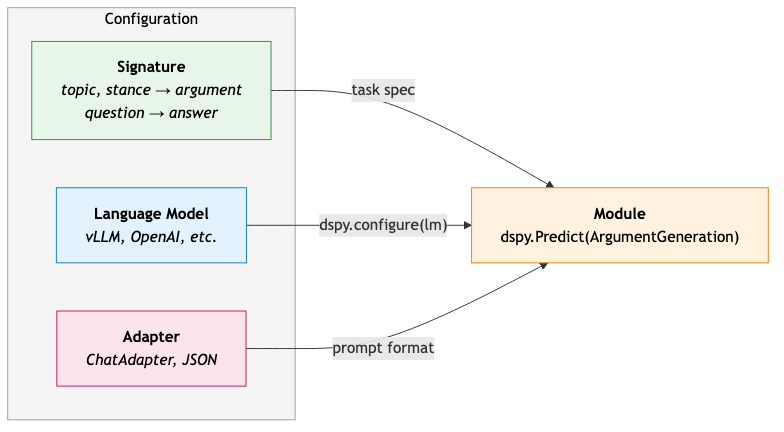

_Mermaid source: `figures/instantiation_phase.mmd`._

#### **Forward (Inference) Phase**

When the Module is called with an [**Example**](https://dspy.ai/learn/evaluation/data/#dspy-example-objects) (which contains values for input fields matching the Signature), the Adapter formats a prompt, the LM generates a response, and the Adapter parses it back into structured fields returned as a **Prediction**. See additional details about Adapters in the [Adapters documentation](https://dspy.ai/learn/programming/adapters/), more on Language Models in the [LM documentation](https://dspy.ai/learn/programming/language_models/), and about Modules in the [Modules documentation](https://dspy.ai/learn/programming/modules/).

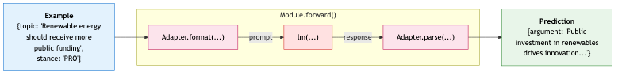

_Mermaid source: `figures/forward_inference.mmd`._

#### **Module Compositionality**

A key strength of DSPy is the ability to **hierarchically compose modules**—using one module within another, or chaining multiple modules in sequence as part of a "parent" module. This enables building complex multi-step pipelines from simple, reusable components.

For example, a `GenerateArgument` module might use two sub-modules: one for generating intermediate claims (one per sub-topic) and another for synthesizing the final argument:

```python
class GenerateArgument(dspy.Module):
    def __init__(self):
        # Sub-module for generating claims about the provided sub-topics, which
        # argue for the provided stance on the overall topic
        self.generate_claim = dspy.Predict('topic: str, stance: Literal["PRO", "ANTI"], subtopic: str -> claim: str')
        # Sub-module for synthesizing final argument from claims
        self.synthesize = dspy.Predict(
            'topic: str, stance: str, claims: list[str] -> argument: str'
        )
    
    def forward(self, topic: str, stance: str, claim_topics: list[str]) -> str:
        # Generate one claim per provided topic
        claims = [
            self.generate_claim(topic=t, stance=stance, subtopic=t).claim 
            for t in claim_topics
        ]
        # Synthesize final argument from all claims
        argument_prediction: dspy.Prediction = self.synthesize(
            topic=topic,
            stance=stance,
            claims=claims
        )
        return argument_prediction.argument
```

This compositionality allows each sub-module to be tested, optimized, and reused independently. See the [DSPy documentation on composing modules](https://dspy.ai/learn/programming/modules/#how-do-i-compose-multiple-modules-into-a-bigger-program) for more details.

---

## **Background: Tree of Thoughts**

**Tree of Thoughts (ToT)** ([Yao et al., 2023](https://papers.nips.cc/paper_files/paper/2023/hash/271db9922b8d1f4dd7aaef84ed5ac703-Abstract-Conference.html)) is a framework for deliberate problem-solving with large language models. While standard autoregressive LMs make token-level, left-to-right decisions during inference, ToT enables exploration over coherent units of text called *thoughts*—intermediate reasoning steps toward solving a problem. ToT frames problem-solving as search over a tree, where each node represents a *state* $s = [x, z_1, \ldots, z_i]$ consisting of the input $x$ and the sequence of thoughts generated so far. The objective of Tree of Thoughts is to create one or more promising candidates for an answer to the problem, $y$. The framework involves four components: (1) *decomposing* the problem into thought steps, (2) *generating* candidate thoughts from each state, (3) *evaluating* states to guide search, and (4) applying a *search algorithm* (e.g., BFS or DFS). ToT has been shown to improve performance on several tasks requiring non-trivial planning or search.

**Limitations of Standard ToT.** Despite its effectiveness, the original Tree of Thoughts framework has several limitations that we address in this work. First, *diversity in branching* is limited—without explicit guidance, sampled thoughts tend to converge to similar content, reducing the benefit of exploring multiple paths. Second, *evaluation functions* are relatively simple, using coarse classifications (e.g., "sure/maybe/impossible") rather than nuanced multi-dimensional rubrics. Third, *there is no mechanism for early stopping*—the search proceeds to a fixed depth regardless of whether sufficient reasoning has already been accumulated. STATe-of-Thoughts addresses these limitations through targeted interventions, weighted multi-dimensional evaluation, and controller-driven early stopping.
Beyond this, ToT lacks structured actions or tools for systematically modulating properties of generated thoughts. In contrast, the controller mechanism selects and records interpretable action choices, enabling efficient exploration of the action space to identify optimal combinations and estimate the effects of different choices.

#### **Baseline: Beam Search over Reasoning**

Standard Tree of Thoughts generates `branching_factor` candidates per node, scores them, and keeps `beam_width` for expansion (i.e., selecting them as the next layer's frontier). 

**Problem:** Without guidance, the model tends to generate to similar reasoning across branches, which results in homogeneous final outputs.

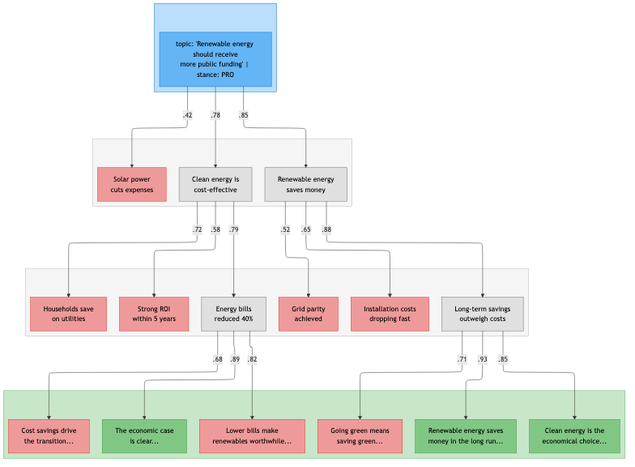

_Mermaid source: `figures/baseline_beam_search.mmd`._

🔵 Input  ·  ⬜ Kept  ·  🟥 Pruned  ·  🟩 Best output

---

## **Method**

We extend DSPy to support **structured multi-step reasoning** with process supervision. Our extensions include:

- **ReasoningSignature** and **ReasoningField**: First-class support for intermediate reasoning steps
- **Core Modules**: Controller, Generator, and Evaluator modules that are used in each step of the Tree of Thoughts algorithm
- **VLLMGeneratorAdapter**: Specialized adapter with pre-filling, stop token control, and batching to generate the branching operation for an entire layer of the tree in parallel
- **Weighted Evaluation**: `rubric_weight` for multi-dimensional scoring

The sections below follow a **top-down** structure: from the Tree of Thoughts algorithm, to the modules that implement it, to the signatures that define tasks, and finally to the adapters that translate everything into LLM prompts.

---

### **1. Tree of Thoughts**

The framework explores reasoning trajectories $Z = [z_1, z_2, \ldots, z_n]$ for a problem input $x$, eventually producing a final output $y$.

#### **STATe-of-Thoughts: Early Stopping + Targeted Interventions**

Our extensions: (1) **Early stopping** — Controller signals `FINISH` when reasoning suffices; (2) **Prefix interventions** — steer generation toward diverse topics.

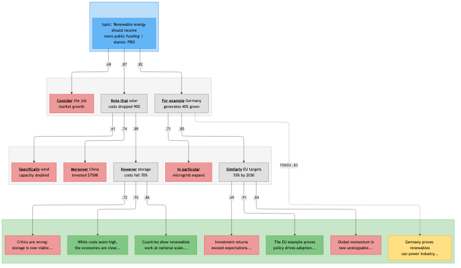

_Mermaid source: `figures/state_of_thoughts_interventions.mmd`._

🔵 Input  ·  ⬜ Kept  ·  🟥 Pruned  ·  🟩 Best output  ·  🟨 Early-stopped  ·  **<u>Underlined</u>** = prefix

#### **Architecture Overview**

The framework implements a **Plan → Generate → Evaluate → Select** cycle using three core modules:

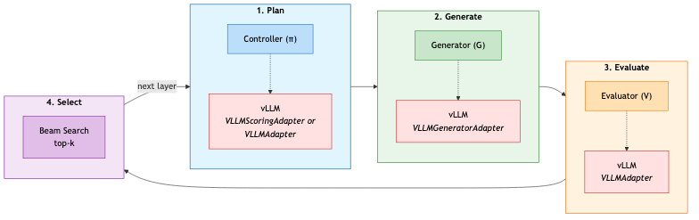

_Mermaid source: `figures/architecture_overview.mmd`._

| Step | Component | Function |
|:-----|:----------|:---------|
| **Plan** | Controller ($\pi$) | Selects actions $a \sim \pi(s_t)$ from action space $\mathcal{A}$ |
| **Generate** | Generator ($G$) | Produces candidates $z_{t+1} \sim G(s_t, a)$ |
| **Evaluate** | Evaluator ($V$) | Scores candidates: $V_\text{PRM}(s)$ or $V_\text{ORM}(y \mid x)$ |
| **Select** | Beam Search | Keeps top-$k$: $\arg\max_k \{V(c) : c \in \text{candidates}\}$ |

#### **Algorithm: STATe-Beam-Search**

> **Note:** This is pseudocode for clarity. See `predict/tree_of_thoughts/tree_of_thoughts.py` for the full implementation.

```python
def state_beam_search(x, generator, controller, evaluator, m, k, n):
    """
    STATe-of-Thoughts beam search over reasoning trajectories.
    
    Args:
        x: Input problem (e.g., {topic: "...", stance: "PRO"})
        generator: Produces reasoning steps or final answers
        controller: Selects actions (interventions) for each state
        evaluator: Scores candidates (PRM for reasoning, ORM for answers)
        m: Branching factor (candidates per node)
        k: Beam width (nodes kept per layer)
        n: Maximum reasoning depth
    
    Returns:
        Best final answer with its reasoning chain
    """
    frontier = [State(input=x)]  # Layer 0: root states
    finals = []                   # Completed reasoning chains
    
    for layer in range(n):
        candidates = []
        
        # === PLAN: Controller selects actions for each state ===
        for state in frontier:
            actions = controller.plan(state, n_actions=m)
            state.actions = actions
        
        # === GENERATE: Produce children from each (state, action) pair ===
        for state in frontier:
            for action in state.actions:
                child = generator.generate(
                    state,
                    prefill=action.intervention,  # Pre-fill assistant response
                    stop_token=action.stop_token  # </step> or </answer>
                )
                
                if action.is_finish:
                    finals.append(child)  # Early stopping
                else:
                    candidates.append(child)
        
        if not candidates:
            break  # All branches terminated early
        
        # === EVALUATE: Score intermediate reasoning steps ===
        for candidate in candidates:
            candidate.score = evaluator.score_prm(candidate)
        
        # === SELECT: Keep top-k for next layer ===
        frontier = sorted(candidates, key=lambda c: c.score, reverse=True)[:k]
    
    # Force final answers from any remaining frontier states
    for state in frontier:
        answer = generator.generate(state, force_finish=True)
        finals.append(answer)
    
    # Score all final answers with outcome evaluator
    for final in finals:
        final.score = evaluator.score_orm(final)
    
    return max(finals, key=lambda f: f.score)
```

**Function Reference:**

| Pseudocode | Implementation | Description |
|:-----------|:---------------|:------------|
| `controller.plan()` | `TreeOfThoughtsController.forward()` | Selects `m` actions per state; each action contains `prefix` and `internal_reasoning` interventions |
| `generator.generate()` | `TreeOfThoughtGenerator.forward()` | Calls vLLM with pre-filled assistant message; stops at `</step>` or `</answer>` |
| `evaluator.score_prm()` | `TreeOfThoughtEvaluator.evaluate_prm()` | Process Reward Model — scores intermediate reasoning |
| `evaluator.score_orm()` | `TreeOfThoughtEvaluator.evaluate_orm()` | Outcome Reward Model — scores final answers |
| `action.intervention` | `ControllerOutput.prefix/internal_reasoning` | Text injected into assistant response via vLLM's `continue_final_message` |
| `action.is_finish` | `ControllerOutput.continue_reasoning=False` | Signals early termination of reasoning |

---

### **2. Core Modules (`predict/`)**

Three modules implement the Tree of Thoughts cycle. Each module wraps an LLM and uses adapters to format prompts and parse outputs.

<table>
<tr>
<th align="left">Module</th>
<th align="left">Role</th>
<th align="left">Input</th>
<th align="left">Output</th>
</tr>
<tr>
<td><b>Controller</b></td>
<td>Select and execute action</td>
<td>State s<sub>t</sub></td>
<td>Interventions (<code>prefix</code>, <code>internal_reasoning</code>, <code>continue_reasoning</code>)</td>
</tr>
<tr>
<td><b>Generator</b></td>
<td>Produce candidates</td>
<td>State + Interventions</td>
<td>Reasoning step or final answer</td>
</tr>
<tr>
<td><b>Evaluator</b></td>
<td>Score quality</td>
<td>Child State (candidate)</td>
<td>Scalar score ∈ [0, 1]</td>
</tr>
</table>

---

#### **Controller**

The Controller ($\pi$) observes the current state and selects actions from an action space $\mathcal{A}$. Two implementations exist:

**Generative Controller** (`TreeOfThoughtsController`): Uses an LLM to generate actions.

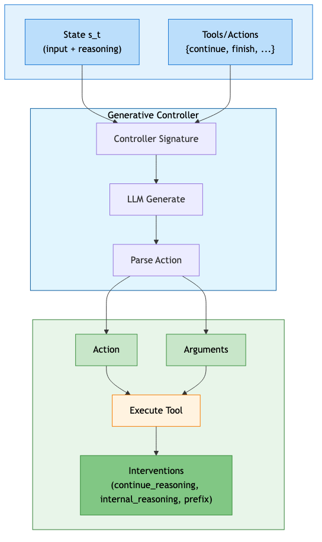

_Mermaid source: `figures/generative_controller.mmd`._

> **Note:** When sampling multiple actions, the generative controller tracks co-occurrence counts for duplicate (tool, arguments) pairs. This allows promising actions to be sampled `n` times (where `n` is the occurrence count), or executed once if deduplication is preferred.

**Reranker Controller** (`TreeOfThoughtsControllerReranker`): Scores all action-argument combinations using a discriminative model.

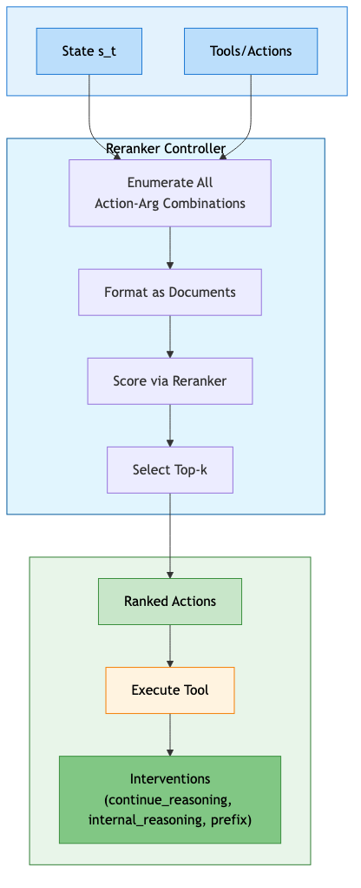

_Mermaid source: `figures/reranker_controller.mmd`._

**Controller Output**: Both controllers produce:

| Field | Description | Example |
|:------|:------------|:--------|
| `action` | The selected tool name | `"continue_reasoning"`, `"finish"`, `"select_style_structure"` |
| `arguments` | Tool arguments (if any) | `{"style": "Trust", "structure": "Contrast"}` |
| `continue_reasoning` | Whether to generate another step | `True` / `False` |
| `internal_reasoning` | First-person planning guidance | `"I should provide evidence..."` |
| `prefix` | Literal text to start generation | `"For example,"`, `"However,"` |

**Defining Tools/Actions**

Tools are automatically generated based on user provided `json` files of the following format:

```json
{
  "name": "Target Audience",
  "definition": "Forces the next reasoning step to adapt language, tone, and examples for a specific age demographic, controlling how information is presented and framed. Interventions along this dimension ensure the next step uses vocabulary, cultural references, and communication styles appropriate for a particular audience (e.g., simple and playful for children, relatable and current for teenagers, or professional and grounded for middle-aged adults).",
  "choices": {
    "children": {
      "definition": "Writes for children ages 5-12 using simple language, examples, and enthusiasm",
      "internal_reasoning": "I should write specifically for children (ages 5-12). I should use very simple words, short sentences, and a cheerful, playful tone with fun, concrete examples. "
    },
    "young_adults": {
      "definition": "Writes for young adults ages 20-35 using modern, direct language with practical examples",
      "internal_reasoning": "I should write specifically for young adults (ages 20-35). I should use clear, modern language with practical examples and a confident, approachable tone. "
    },
    "seniors": {
      "definition": "Writes for seniors (ages 56+) using clear, respectful and reminiscent language",
      "internal_reasoning": "I should write specifically for seniors (ages 56+). I should use clear, respectful language with a warm tone, gentle pacing, and thoughtfully explained examples. "
    }
  }
}

{
  "name": "Reasoning Action",
  "definition": "Forces the next reasoning step to perform a specific analytical operation focused on understanding and satisfying constraints, controlling the type of cognitive work being done. Interventions along this dimension ensure the next step executes a particular reasoning function (e.g., breaking down requirements, identifying potential conflicts, planning compliance strategies, or validating solutions against constraints).",
  "choices": {
    "clarify_constraints": {
      "definition": "Breaks down instructions into distinct requirements and ensures every rule is explicitly understood",
      "internal_reasoning": "I should break down the instructions into distinct requirements. I should ensure every rule or constraint is explicitly understood and clarified. For constraints involving upper or lower bounds, I should add a reasonable buffer such that the output unmistakably meets the specified constraints. ",
      "prefix": "Let me first clarify"
    },
    "identify_challenges": {
      "definition": "Highlights constraints likely to conflict or be hard to satisfy, considering edge cases and ambiguities",
      "internal_reasoning": "I should identify constraints that are likely to conflict or be hard to satisfy. I should consider edge cases, rare conditions, and ambiguities in the instructions and identify strategies to safely satisfy the constraints. ",
      "prefix": "The main challenges are"
    },
    ...
    "candidate_solution": {
      "definition": "Proposes a complete candidate solution that attempts to satisfy all constraints",
      "internal_reasoning": "I should propose a complete candidate solution that attempts to satisfy all constraints. I should build on previous analyses and ensure the solution is satisfying the constraints. ",
      "prefix": "Here is a candidate solution"
    }
  }
}

```

When the Controller selects `candidate_solution` for `Reasoning Action`, the Generator receives:
- `internal_reasoning`: *"I should propose a complete candidate solution that attempts to satisfy all constraints. I should build on previous analyses and ensure the solution is satisfying the constraints. "*
- `prefix`: *"Here is a candidate solution"*

The Generator then pre-fills the assistant message with these interventions before generating.

---

#### **Generator**

The Generator ($G$) expands the reasoning tree by producing candidate thoughts $z_{t+1} \sim G(s_t, a)$ or final outputs $y$.

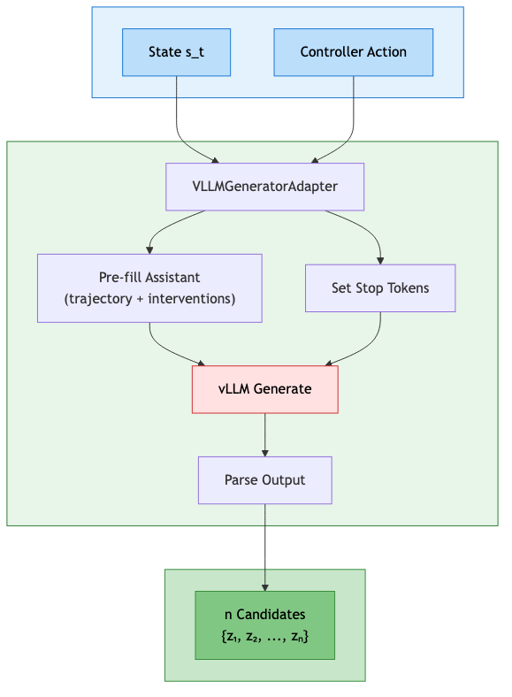

_Mermaid source: `figures/generator_flow.mmd`._

**Usage:**

```python
candidates = generator(
    states=[current_state],
    continue_reasoning=[True],                      # Generate reasoning (not final answer)
    internal_reasoning=["I should add evidence"],   # Controller's planning guidance
    prefix=["For example,"],                        # Constrain generation start
    n_samples=3,                                    # Number of candidates
)
# Returns: [
# {"claim": "For example, studies show..."}, 
# {"claim": "For example, a recent Neurips paper states that..."}, 
# {"claim": "For example, a recent Nature paper finds that..."}
# ...
# ]
```

---

#### **Evaluator**

The Evaluator ($V$) assigns scalar scores to guide beam search:

- **PRM (Process Reward Model)**: Scores intermediate reasoning $V_\text{PRM}(s_t) \to [0,1]$
- **ORM (Outcome Reward Model)**: Scores final outputs $V_\text{ORM}(y|x) \to [0,1]$

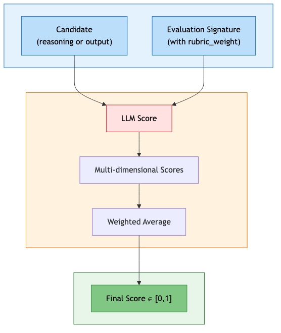

_Mermaid source: `figures/evaluator_flow.mmd`._

**Weighted Rubrics**: The Evaluator uses `rubric_weight` from the signature to combine multiple dimensions:

$$\text{score} = \sum_i (\text{score}_i \times \text{weight}_i)$$

---

### **3. Adapters (`adapter/`)**

Adapters translate abstract signatures into concrete LLM prompts and parse outputs back into structured data.

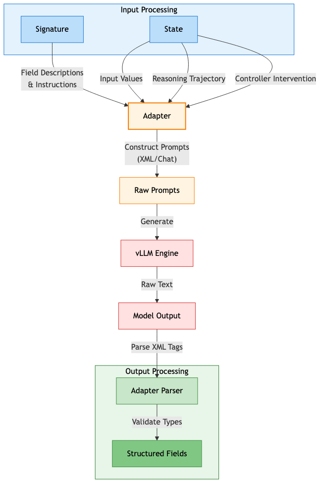

_Mermaid source: `figures/adapters_overview.mmd`._

#### **VLLMGeneratorAdapter**

The core adapter for multi-step reasoning with four key capabilities:

**1. XML-based Reasoning Template**

Structures LLM responses using XML tags:

```text
<thinking>
<step>
## internal_reasoning
I should introduce my primary claim
## claim
Studies show that renewable energy reduces costs...
</step>
<step>
## internal_reasoning
I should acknowledge counterarguments
## claim
While opponents argue that...
</step>
...
</thinking>
<answer>
## argument
Renewable energy is economically beneficial because...
</answer>
```

We are able to recognize natural "stopping points" in the model's response through XML tags like `</step>` and `</answer>`. We can introduce interventions by injecting internal reasoning and the first few tokens of the reasoning step (in this case, `## claim`) before the model continues generating.

**2. Stop Token Control**

| Controller Decision | Stop Token | Result |
|:--------------------|:-----------|:-------|
| `continue_reasoning=True` | `</step>` | One reasoning step |
| `continue_reasoning=False` | `</answer>` | Final output |

**3. Assistant Pre-filling**

Injects controller interventions using vLLM's `continue_final_message`:

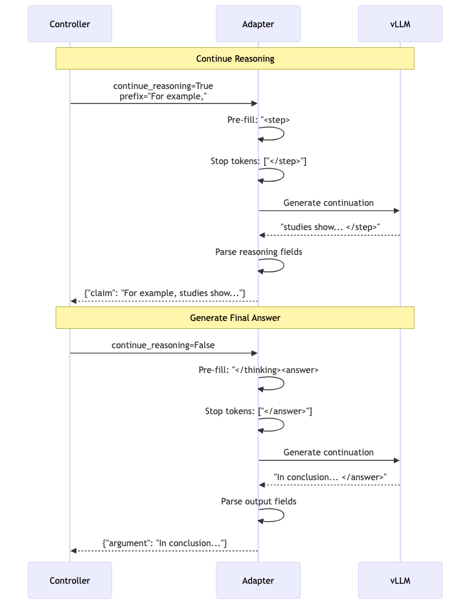

_Mermaid source: `figures/assistant_prefill_sequence.mmd`._

**4. Heterogeneous Batching**

Process mixed batches where each item independently continues reasoning or generates output:

```python
outputs = adapter(
    signature=ArgumentGeneration,
    inputs={"topic": "AI", "stance": "PRO"},
    continue_reasoning=[
        [True],   # Trajectory 1: Generate another step
        [False],  # Trajectory 2: Generate final answer
    ],
    previous_content=[traj1_history, traj2_history],
    lm_kwargs={"temperature": 0.7, "n": 2},
)
# Returns: [[step1a, step1b], [answer2a, answer2b]]
```

---

## **Quick Start**

Assume, we have defined controller actions in `path/to/actions.json` as follows
```json
{
  "name": "Reasoning Action",
  "definition": "Select a reasoning action for constraint-focused analysis in the next reasoning step",
  "choices": {
    "clarify_constraints": {
      "definition": "Breaks down instructions into distinct requirements and ensures every rule is explicitly understood",
      "internal_reasoning": "I should break down the instructions into distinct requirements. I should ensure every rule or constraint is explicitly understood and clarified. For constraints involving upper or lower bounds, I should add a reasonable buffer such that the output unmistakably meets the specified constraints. ",
      "prefix": "Let me first clarify"
    },
    "identify_challenges": {
      "definition": "Highlights constraints likely to conflict or be hard to satisfy, considering edge cases and ambiguities",
      "internal_reasoning": "I should identify constraints that are likely to conflict or be hard to satisfy. I should consider edge cases, rare conditions, and ambiguities in the instructions and identify strategies to safely satisfy the constraints. ",
      "prefix": "The main challenges are"
    }
  }  
}
```

Here is a minimal example of running a Tree of Thoughts pipeline.

```python
from lm.local_lm import LocalVLLM
from predict.tree_of_thoughts import TreeOfThoughts
from signatures import ReasoningSignature, InputField, ReasoningField, OutputField

# 1. Define Signatures and Controller Choices
class QuestionAnsweringWithReasoning(ReasoningSignature):
    """Answer the question by reasoning step-by-step."""
    question: str = InputField(desc="The question to answer")
    reasoning_step: str = ReasoningField(desc="A step in the reasoning process")
    answer: str = OutputField(desc="The final answer")

class EvaluateAnswer(ReasoningSignature):
    """Evaluate the quality of an answer."""
    question: str = InputField(desc="The original question")
    answer: str = InputField(desc="The answer to evaluate")
    score: int = OutputField(desc="Quality score 1-10", ge=1, le=10)

# 2. Initialize Models
generative_lm = LocalVLLM(model="Qwen/Qwen3-30B-Instruct", task="generate")
evaluator_lm = LocalVLLM(model="Qwen/Qwen3-Reranker-8B", task="score")

# 3. Configure Tree of Thoughts
tot = TreeOfThoughts(
    generator_signature=QuestionAnsweringWithReasoning,
    evaluator_signature=EvaluateAnswer,
    generative_lm=generative_lm,
    evaluator_lm=evaluator_lm,
    action_space_paths=PATH/TO/ACTIONS.json
)

# 4. Run Inference
output = tot(
    question="What are the long-term economic effects of AI?",
    max_depth=3,
    top_k=2
)

print(f"Final Answer: {output.answer}")
```

---

## **Documentation Map**

- **[Language Models (lm/)](lm/README.md)**: VLLM integration for generation and scoring
- **[Adapters (adapter/)](adapter/README.md)**: Bridging DSPy signatures to VLLM prompts
- **[Prediction Logic (predict/)](predict/README.md)**: Controller, Generator, and Evaluator modules
  - **[Tree of Thoughts (predict/tree_of_thoughts/)](predict/tree_of_thoughts/README.md)**: The core search algorithm
- **[Signatures (signatures/)](signatures/README.md)**: Custom fields and reasoning schemas

---

## **Installation**

### **Prerequisites**

- **Python 3.12+**
- **GPUs:** Recommended setup is 2 GPUs (e.g., GPU 0 for Generation, GPU 1 for Reranking)

### **Environment Setup**

This project uses [uv](https://github.com/astral-sh/uv) for fast, reliable Python package management. Dependencies are automatically selected based on your platform using environment markers.

#### **Quick Start**

```bash
# Install uv if not already available
curl -LsSf https://astral.sh/uv/install.sh | sh

# Install all dependencies (automatically handles platform differences)
make install
```

The installation automatically:
- Installs all core dependencies on both platforms
- On **Linux**: Installs vllm and GPU packages (bitsandbytes, flashinfer, unsloth) via `uv sync`
- On **macOS**: Installs pip, then uses it to install vllm (avoids CUDA dependency conflicts)

#### **What gets installed**

**All platforms:**
- Core ML packages (torch, dspy, transformers, accelerate, datasets)
- Testing and linting tools (pytest, ruff, mypy)
- Additional utilities (litellm, httpx-aiohttp, openai, psutil)

**Linux only** (via `sys_platform == 'linux'` markers):
- vllm==0.12.0
- bitsandbytes
- flashinfer-python
- unsloth

**macOS:** vllm is installed via pip (see below)

#### **Why the macOS workaround?**

vllm has optional CUDA dependencies (like `nvidia-cudnn-frontend`) that are Linux-only. When you run `uv sync`, uv's dependency resolver sees these requirements and fails on macOS because they don't have macOS wheels.

**Manual installation** (if needed):
```bash
uv sync

# On macOS only:
uv pip install --python .venv/bin/python pip
.venv/bin/pip install vllm==0.12.0
```

#### **Download Models**

After installation, download the required models:

```bash
# Activate the virtual environment
source .venv/bin/activate

# Download models (example)
huggingface-cli download Qwen/Qwen3-30B-A3B-Instruct-2507 \
    --local-dir /path/to/model_storage/Qwen3-30B-A3B-Instruct-2507
```

## **Usage: Running Experiments**

The main entry point is `experiments/argument_generation/run_argument_generation.py`:

```bash
python experiments/argument_generation/run_argument_generation.py \
    --model Qwen3-30B-A3B-Instruct-2507 \
    --reranker_model Qwen3-Reranker-8B \
    --model_directory /path/to/model_storage \
    --generative_gpu_index 0 \
    --reranker_gpu_index 1 \
    --depth 3 \
    --n_samples_generation 5 \
    --top_k 2 \
    --do_pruning \
    --do_save_tree \
    --outputs_directory ./experiments/argument_generation/tot_outputs \
    --outputs_filename argument_generation_run
```

> **Note:** This script requires **two separate GPUs** by default — one for the generative model (Generator, Evaluator, and optionally the generative Controller) and one for the reranker model (Controller action scoring).

### **Key Flags**

| Flag | Description | Default |
|:-----|:------------|:--------|
| `--model` | Generative model name | `Qwen3-30B-A3B-Instruct-2507` |
| `--reranker_model` | Reranker model for scoring | `Qwen3-Reranker-8B` |
| `--model_directory` | Directory containing downloaded models | `/projects/BSTEWART/model_storage` |
| `--generative_gpu_index` | GPU index for generative model | `0` |
| `--reranker_gpu_index` | GPU index for reranker model | `1` |

**Tree Search Parameters:**

| Flag | Description | Default |
|:-----|:------------|:--------|
| `--depth` | Maximum depth of reasoning tree ($n$) | `2` |
| `--n_samples_generation` | Candidates per node ($m$) | `3` |
| `--top_k` | Beam width ($k$) | `2` |
| `--do_pruning` | Enable pruning low-scoring nodes | `False` |
| `--use_self_consistency` | Enable self-consistency voting | `False` |
| `--num_final_candidates` | Number of final outputs to return | `1` |

**Generation Parameters:**

| Flag | Description | Default |
|:-----|:------------|:--------|
| `--generator_temperature` | Temperature for generation | `1.0` |
| `--controller_temperature` | Temperature for generative controller | `1.2` |
| `--judge_temperature` | Temperature for evaluator | `0.7` |
| `--experiment_mode` | Final output method: `synthesis_faithful`, `synthesis_unfaithful`, or `conclusion` | `synthesis_faithful` |

**Output & Logging:**

| Flag | Description | Default |
|:-----|:------------|:--------|
| `--do_save_tree` | Save full tree structure to disk | `False` |
| `--outputs_directory` | Directory for saved outputs | Current directory |
| `--outputs_filename` | Filename for outputs (auto-timestamped if not set) | `None` |
| `--verbosity` | Logging level: `debug`, `info`, `warning`, `error` | `info` |

---

## **Testing**

The test suite includes both **mock-based unit tests** (fast, no GPU required) and **integration tests** (require GPU access).

### **Mock-Based Unit Tests**

Unit tests use `MockLocalVLLM` from `utilities_for_tests.py` to simulate model responses without requiring actual GPU resources:

```bash
# Run all unit tests (if running from the root directory)
pytest .

# Individual components
pytest lm/test_local_lm.py                      # Local LLMs (hosted with vLLM)
pytest signatures/test_field.py                 # Fields
pytest signatures/test_signatures.py            # Signatures
pytest adapter/test_vllm_adapter.py             # Generative LLM adapter for direct generation
pytest adapter/test_vllm_scoring_adapter.py     # Reranker LLM adapter
pytest adapter/test_vllm_generator_adapter.py   # Generative LLM adapter for multi-step reasoning
pytest predict/test_controller_reranker.py      # Reranker controller
pytest predict/test_generator.py                # Generator
pytest predict/test_evaluator.py                # Evaluator (weighted scoring)
pytest predict/test_controller.py               # Controller
```

### **Integration Tests**

Integration tests require access to GPUs and run against real models. Simply run the same tests as above in a system with GPUs, and integration tests will run rather than get skipped.
