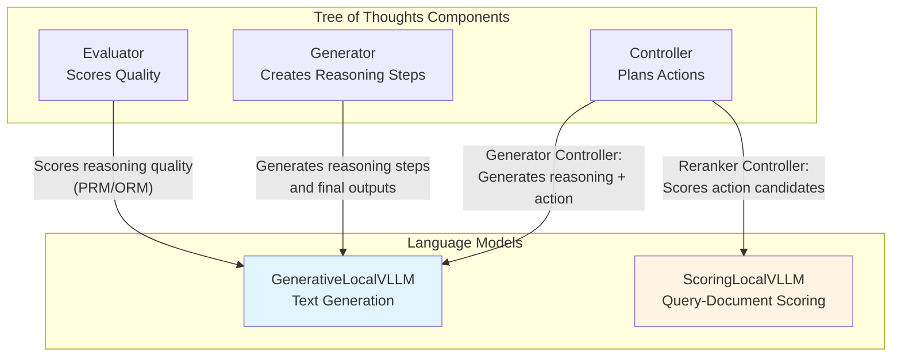
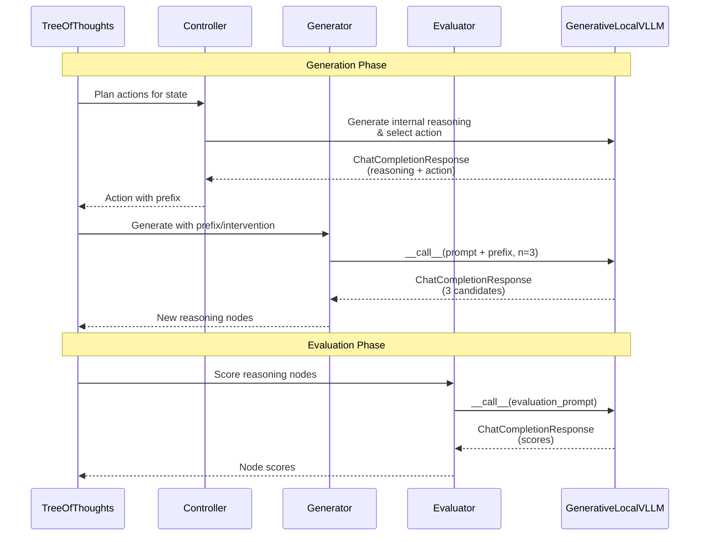
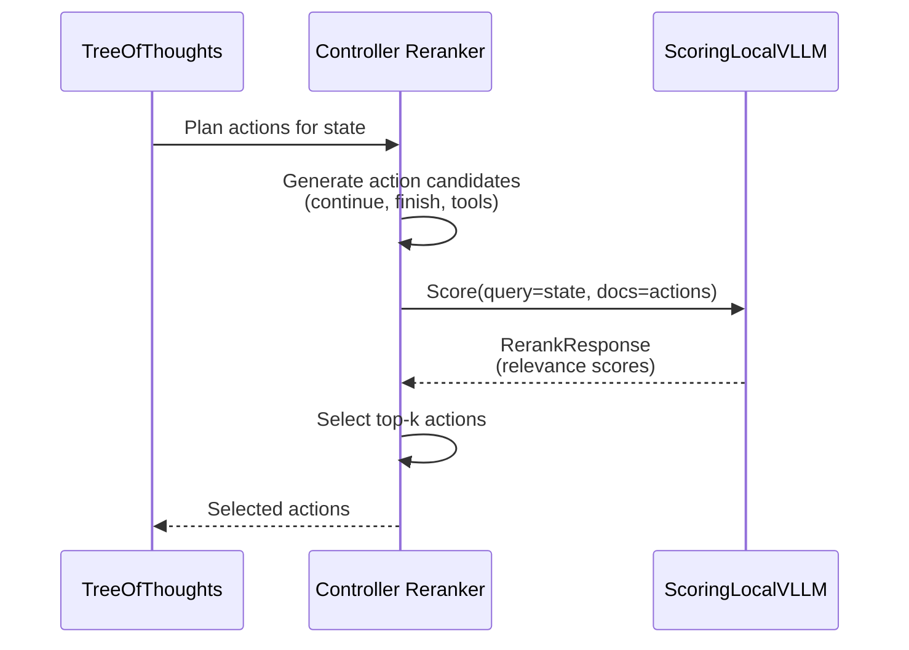

# Language Model (LM)

This directory contains the **Language Model** integrations for the framework.

> **Why Custom Integration?**
>
> Traditional DSPy relies primarily on LiteLLM and its OpenAI-style API interface. However, our **Tree of Thoughts** implementation requires access to **pre-filling** functionality (forcing the start of the assistant's response) to steer reasoning trajectories. This capability is natively supported by Anthropic's API, HuggingFace (transformers), and **vLLM**, but is not consistently available in standard OpenAI-compatible endpoints. Therefore, we implement direct wrappers around `vLLM`.

## Architecture Overview



## Core Components

The language model (LM) class is split into two specialized types:

### 1. `GenerativeLocalVLLM` (`generative_local_lm.py`)
Generates text completions from prompts or conversation threads. Returns `ChatCompletionResponse` objects (OpenAI/LiteLLM format). Used for generator and evaluator components in Tree of Thoughts.

#### Basic Usage
```python
from lm.generative_local_lm import GenerativeLocalVLLM
import dspy

# Initialize generative model
generative_lm = GenerativeLocalVLLM(model="{path_to_model}/Qwen3-30B-A3B-Instruct-2507")

# Use as default DSPy LM
dspy.settings.configure(lm=generative_lm)

# Example: Generate text
response = generative_lm(
    messages=[{"role": "user", "content": "What are the benefits of UBI?"}],
    temperature=0.7,
    max_tokens=200,
)
print(response.choices[0].message.content)
```

#### Usage in Tree of Thoughts


### 2. `ScoringLocalVLLM` (`scoring_local_lm.py`)
Evaluates relevance of query-document pairs for reranking. Returns `RerankResponse` objects (Cohere format via LiteLLM). Used for controller reranker component in Tree of Thoughts.

#### Basic Usage
```python
from lm.scoring_local_lm import ScoringLocalVLLM

# Initialize reranker model
reranker_lm = ScoringLocalVLLM(
    model="{path_to_model}/Qwen3-Reranker-8B",
    tensor_parallel_size=1,
    gpu_memory_utilization=0.9,
)

# Example: Score query-document pairs
query = "What are the economic benefits of UBI?"
documents = [
    "UBI reduces poverty by providing stable income.",
    "UBI stimulates local economies through spending.",
    "Critics argue UBI is too expensive to implement.",
]

response = reranker_lm(
    query=query,
    documents=documents,
)

# Access scores
for result in response.results:
    print(f"Doc {result.index}: {result.relevance_score:.3f}")
```

#### Usage in Tree of Thoughts


Both classes are DSPy-compatible, support batch processing, and initialize the vLLM engine with configurable model and quantization settings.

## Key Differences

| Feature | `GenerativeLocalVLLM` | `ScoringLocalVLLM` |
|---------|----------------------|-------------------|
| **Primary Use Case** | Text generation | Query-document scoring/reranking |
| **Return Type** | `ChatCompletionResponse` | `RerankResponse` |
| **Input Format** | Prompts/conversation threads | Query-document pairs |
| **Typical Models** | Instruction-tuned models (e.g., Qwen3-30B-Instruct) | Reranker models (e.g., Qwen3-Reranker-8B) |
| **Use in ToT** | Generator, (potentially) evaluator, and (potentially) controller components | (Potentially) controller reranker and (potentially) evaluator components |

## Combined Usage Example

In a default Tree of Thoughts setup with a reranker controller, you'll use both classes:

```python
from lm.generative_local_lm import GenerativeLocalVLLM
from lm.scoring_local_lm import ScoringLocalVLLM
from predict.tree_of_thoughts import TreeOfThoughts

# Initialize generative model for text generation
generative_lm = GenerativeLocalVLLM(
    model="{path_to_model}/Qwen3-30B-A3B-Instruct-2507",
)

# Initialize reranker model for action scoring
reranker_lm = ScoringLocalVLLM(
    model="{path_to_model}/Qwen3-Reranker-8B",
)

# Use generative model as default DSPy LM
dspy.settings.configure(lm=generative_lm)

# Pass reranker to TreeOfThoughts for controller
tot = TreeOfThoughts(
    generator_signature=YourSignature,
    generative_lm=generative_lm,
    reranker_lm=reranker_lm,
    controller_type=ControllerType.RERANKER,
    # ... other parameters
)

# Score query-document pairs (pairwise mode)
queries = ["Question: What is the capital of France?"]
documents = ["Paris", "London", "Berlin"]
responses = reranker_lm.forward(queries=queries, documents=documents)

# Access scores
for response in responses:
    for result in response.results:
        print(f"Document {result.index}: {result.relevance_score}")
# Example output: Document 0: 0.95, Document 1: 0.12, Document 2: 0.08

# Access usage statistics
usage = responses[0].meta  # Contains prompt_tokens, completion_tokens, total_tokens
```

**Broadcast Mode:** For controller action scoring, set `broadcast_scores=True` to group scores by query:

```python
# Broadcast mode: score multiple actions per state
responses = reranker_lm.forward(
    queries=queries,  # Arranged as [q1, q1, q1, q2, q2, q2, ...]
    documents=documents,  # Arranged as [d1, d2, d3, d1, d2, d3, ...]
    broadcast_scores=True
)
# Returns one RerankResponse per unique query, each containing scores for all documents
```

**Usage Tracking:** Token usage is automatically tracked for all scoring calls with the DSPy/LiteLLM convention.
