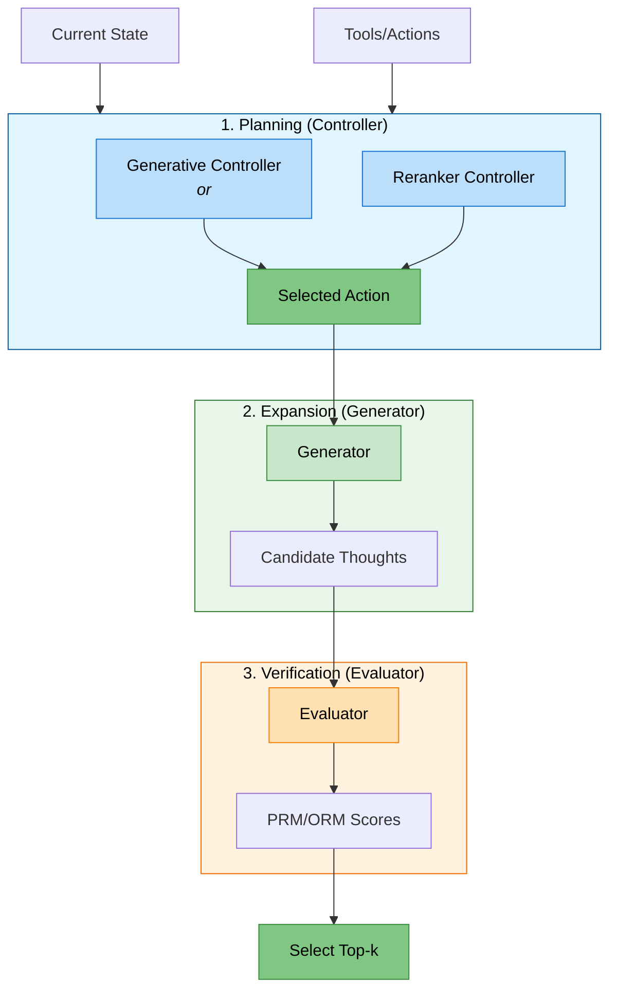
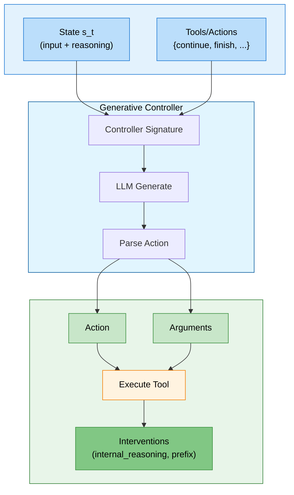
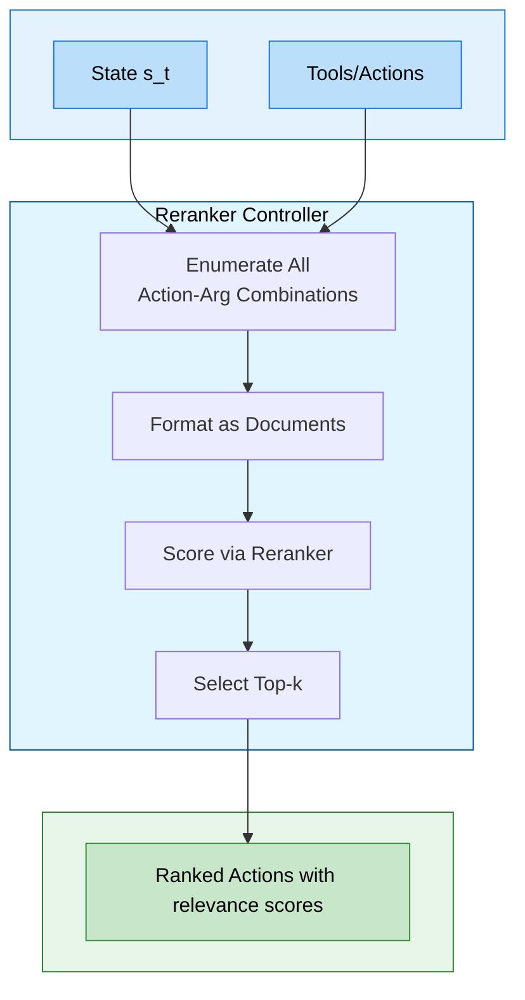
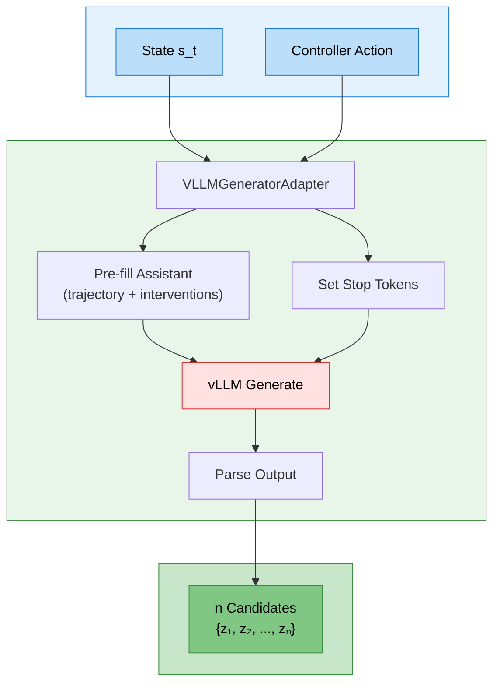
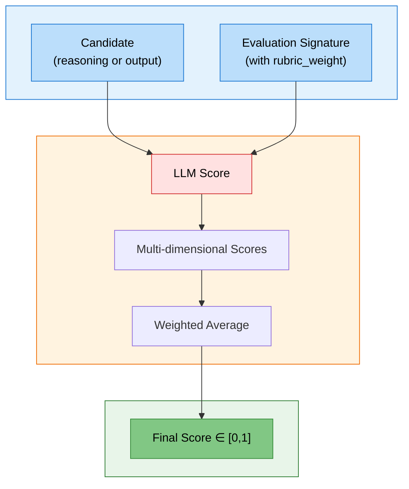

# Prediction Logic (`predict/`)

This directory contains the core modules for the **Tree of Thoughts** reasoning framework: **Controller**, **Generator**, and **Evaluator**.

---

## Overview

Three modules implement the Tree of Thoughts cycle. Each module wraps an LLM and uses adapters to format prompts and parse outputs.

| Module | Role | Input | Output |
|:-------|:-----|:------|:-------|
| **Controller** | Decide next action | State $s_t$ | Action $a$ with interventions |
| **Generator** | Produce candidates | State + Action | Reasoning step or final answer |
| **Evaluator** | Score quality | Child State (candidate) | Scalar score $\in [0, 1]$ |

---



---

## Controller

The Controller ($\pi$) observes the current state and selects actions from an action space $\mathcal{A}$. Two implementations exist:

### Generative Controller (`controller.py`)

Uses an LLM to generate actions. The "brain" of the system that decides the next action to take.

- **Function:** Observes the current state and selects a tool (e.g., `continue_reasoning`, `finish`, or custom tools).
- **Logic:** Uses a `LocalPredict` instance to **generate** an action and arguments.



### Reranker Controller (`controller_reranker.py`)

An alternative controller that uses a **reranker** model to score all action-argument combinations.

- **Function:** Scores all possible actions (and their argument combinations) based on relevance to the current state.
- **Logic:**
  1. Enumerates all valid actions and argument combinations.
  2. Uses `LocalVLLMScoringAdapter` to score each candidate action against the current reasoning history.
  3. Selects the top-k highest-scoring actions.
- **Use Case:** Better for scenarios where the set of actions is finite and well-defined. While a generative controller often produces less diversity (predicts the same action multiple times), a reranker controller provides a full distribution over all possible actions, enabling sampling for greater diversity.



### Controller Output

Both controllers produce:

| Field | Description | Example |
|:------|:------------|:--------|
| `action` | The selected tool name | `"continue_reasoning"`, `"finish"`, `"select_style_structure"` |
| `arguments` | Tool arguments (if any) | `{"style": "Trust", "structure": "Contrast"}` |
| `continue_reasoning` | Whether to generate another step | `True` / `False` |
| `internal_reasoning` | First-person planning guidance | `"I should provide evidence..."` |
| `prefix` | Literal text to start generation | `"For example,"`, `"However,"` |

### Defining Tools/Actions

Tools are functions wrapped as `dspy.Tool` that return interventions:

```python
from dspy import Tool

def select_style_structure(style: str, structure: str) -> dict:
    """Select style and structure for the next reasoning step."""
    STYLE_OPTIONS = {
        "Knowledge": "I should present logical arguments based on facts...",
        "Trust": "I should build credibility and establish trust...",
    }
    STRUCTURE_OPTIONS = {
        "Contrast": "However",
        "Cause": "Therefore",
        "Example": "For example",
    }
    return {
        "internal_reasoning": STYLE_OPTIONS[style],
        "prefix": STRUCTURE_OPTIONS[structure],
        "continue_reasoning": True,
    }

# Wrap as dspy.Tool
style_structure_tool = Tool(
    name="select_style_structure",
    func=select_style_structure,
    desc="Select communication style and discourse structure.",
    args={
        "style": "One of: Knowledge, Trust",
        "structure": "One of: Contrast, Cause, Example",
    },
)
```

When the Controller selects `style="Trust"` and `structure="Contrast"`, the Generator receives:
- `internal_reasoning`: *"I should build credibility and establish trust..."*
- `prefix`: *"However"*

### Usage Example

```python
from predict.controller_reranker import TreeOfThoughtsControllerReranker
from signatures.example_signatures import QuestionAnsweringWithReasoning

# Initialize Reranker Controller
controller = TreeOfThoughtsControllerReranker(
    signature=QuestionAnsweringWithReasoning,
    max_reasoning_steps=5,
    tools=[continue_tool, finish_tool]
)
controller.set_lm(reranker_lm)

# Decide next action
actions = controller(states=current_state, n_samples_generation=1)
```

---

## Generator (`generator.py`)

The Generator ($G$) expands the reasoning tree by producing candidate thoughts $z_{t+1} \sim G(s_t, a)$ or final outputs $y$.

- **Function:** Takes a state and an action (from the Controller) and generates multiple candidate reasoning steps or a final answer.
- **Logic:** Uses `VLLMGeneratorAdapter` to format the prompt with the reasoning history and the chosen action.



### Usage Example

```python
candidates = generator(
    states=[current_state],
    continue_reasoning=[True],                      # Generate reasoning (not final answer)
    internal_reasoning=["I should add evidence"],   # Controller's planning guidance
    prefix=["For example,"],                        # Constrain generation start
    n_samples=3,                                    # Number of candidates
)
# Returns: [
#     {"claim": "For example, studies show..."}, 
#     {"claim": "For example, a recent NeurIPS paper states that..."}, 
#     {"claim": "For example, a recent Nature paper finds that..."}
# ]
```

---

## Evaluator (`evaluator.py`)

The Evaluator ($V$) assigns scalar scores to guide beam search:

- **PRM (Process Reward Model)**: Scores intermediate reasoning $V_\text{PRM}(s_t) \to [0,1]$
- **ORM (Outcome Reward Model)**: Scores final outputs $V_\text{ORM}(y|x) \to [0,1]$

**Function:** Provides feedback on the generated thoughts by assigning scores to reasoning steps and final answers.

**Logic:** Uses `LocalPredict` with specific evaluation signatures. Supports weighted rubrics (via `rubric_weight`) to combine multiple evaluation dimensions into a single score.



### Weighted Rubrics

The Evaluator uses `rubric_weight` from the signature to combine multiple dimensions:

$$\text{score} = \sum_i (\text{score}_i \times \text{weight}_i)$$

```python
class EvaluateArgument(dspy.Signature):
    """Evaluate an argument on multiple dimensions."""
    argument: str = InputField(desc="The argument to evaluate")
    
    # Weighted scoring: 30% + 30% + 40% = 100%
    persuasiveness: int = OutputField(
        desc="How convincing (1-7)", rubric_weight=0.3, ge=1, le=7
    )
    coherence: int = OutputField(
        desc="How well-structured (1-7)", rubric_weight=0.3, ge=1, le=7
    )
    relevance: int = OutputField(
        desc="How on-topic (1-7)", rubric_weight=0.4, ge=1, le=7
    )
```

---

## Supporting Classes

### `LocalPredict` (`local_predict.py`)

A base class for prediction modules in this framework.

- **Function:** Extends `dspy.Predict` to work seamlessly with `LocalVLLM` and `VLLMAdapter`.
- **Features:** Handles batch processing of inputs and manages the interaction with the local VLLM for generation.

### Tree of Thoughts (`tree_of_thoughts/`)

The main orchestrator that combines Controller, Generator, and Evaluator into a beam search algorithm. See `tree_of_thoughts/README.md` for details on the search algorithm.

---

## File Structure

```
predict/
├── controller.py              # Generative Controller
├── controller_reranker.py     # Reranker Controller
├── controller_constants.py    # Controller type enums
├── controller_utils.py        # Controller utilities
├── generator.py               # Generator module
├── evaluator.py               # Evaluator module
├── local_predict.py           # Base prediction class
├── tree_of_thoughts/          # Tree search orchestration
│   ├── tree_of_thoughts.py    # Main ToT algorithm
│   ├── tree_parameters.py     # Search parameters
│   └── README.md              # ToT documentation
├── demos/                     # Example demonstrations
└── test_*.py                  # Unit tests
```
