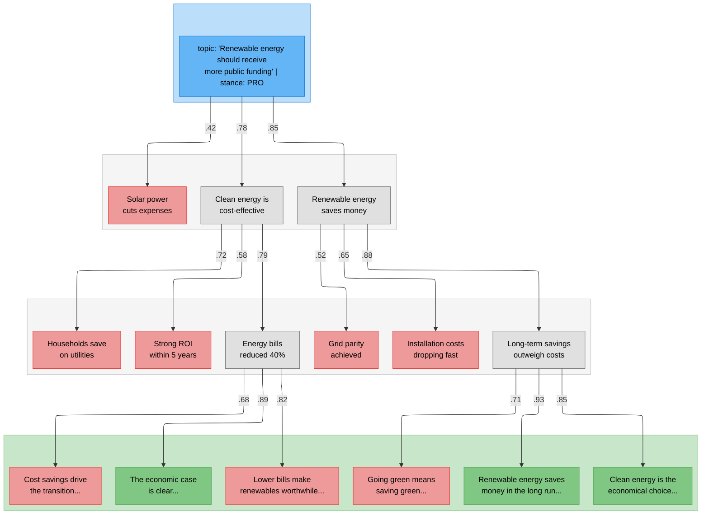
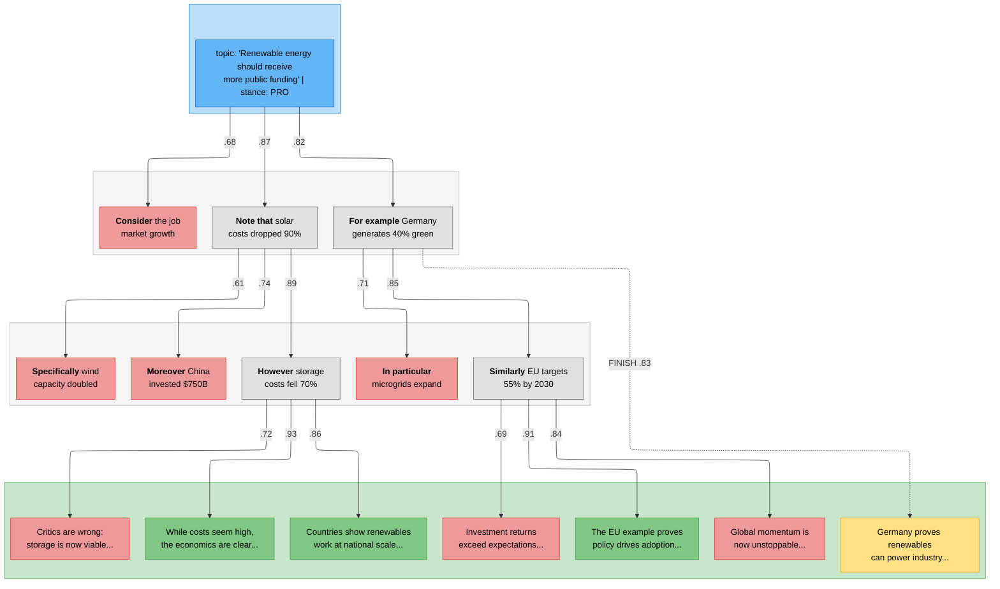
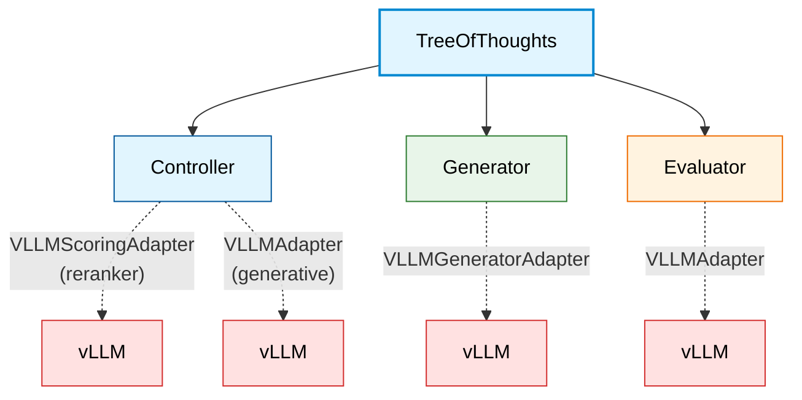

# Tree of Thoughts (ToT)

This directory contains the implementation of the **STATe-of-Thoughts** search algorithm — a beam search over reasoning trajectories with targeted interventions.

---

## Overview

The framework explores reasoning trajectories $Z = [z_1, z_2, \ldots, z_n]$ for a problem input $x$, eventually producing a final output $y$.

### Baseline: Beam Search over Reasoning

Standard Tree of Thoughts generates `branching_factor` candidates per node, scores them, and keeps `beam_width` for expansion (i.e., selecting them as the next layer's frontier).

**Problem:** Without guidance, the model converges to similar paths, producing homogeneous outputs.



🔵 Input  ·  ⬜ Kept  ·  🟥 Pruned  ·  🟩 Best output

### STATe-of-Thoughts: Early Stopping + Targeted Interventions

Our extensions: (1) **Early stopping** — Controller signals `FINISH` when reasoning suffices; (2) **Prefix interventions** — steer generation toward diverse topics.



🔵 Input  ·  ⬜ Kept  ·  🟥 Pruned  ·  🟩 Best output  ·  🟨 Early-stopped  ·  **Bold** = prefix

---

## Architecture

The framework implements a **Plan → Generate → Evaluate → Select** cycle using three core modules:



| Step | Component | Function |
|:-----|:----------|:---------|
| **Plan** | Controller ($\pi$) | Selects actions $a \sim \pi(s_t)$ from action space $\mathcal{A}$ |
| **Generate** | Generator ($G$) | Produces candidates $z_{t+1} \sim G(s_t, a)$ |
| **Evaluate** | Evaluator ($V$) | Scores candidates: $V_\text{PRM}(s)$ or $V_\text{ORM}(y|x)$ |
| **Select** | Beam Search | Keeps top-$k$: $\arg\max_k \{V(c) : c \in \text{candidates}\}$ |

---

## Algorithm: STATe-Beam-Search

> **Note:** This is pseudocode for clarity. See `tree_of_thoughts.py` for the full implementation.

```python
def state_beam_search(x, generator, controller, evaluator, m, k, n):
    """
    STATe-of-Thoughts beam search over reasoning trajectories.
    
    Args:
        x: Input problem (e.g., {topic: "...", stance: "PRO"})
        generator: Produces reasoning steps or final answers
        controller: Selects actions (interventions) for each state
        evaluator: Scores candidates (PRM for reasoning, ORM for answers)
        m: Branching factor (candidates per node)
        k: Beam width (nodes kept per layer)
        n: Maximum reasoning depth
    
    Returns:
        Best final answer with its reasoning chain
    """
    frontier = [State(input=x)]  # Layer 0: root states
    finals = []                   # Completed reasoning chains
    
    for layer in range(n):
        candidates = []
        
        # === PLAN: Controller selects actions for each state ===
        for state in frontier:
            actions = controller.plan(state, n_actions=m)
            state.actions = actions
        
        # === GENERATE: Produce children from each (state, action) pair ===
        for state in frontier:
            for action in state.actions:
                child = generator.generate(
                    state,
                    prefill=action.intervention,  # Pre-fill assistant response
                    stop_token=action.stop_token  # </step> or </answer>
                )
                
                if action.is_finish:
                    finals.append(child)  # Early stopping
                else:
                    candidates.append(child)
        
        if not candidates:
            break  # All branches terminated early
        
        # === EVALUATE: Score intermediate reasoning steps ===
        for candidate in candidates:
            candidate.score = evaluator.score_prm(candidate)
        
        # === SELECT: Keep top-k for next layer ===
        frontier = sorted(candidates, key=lambda c: c.score, reverse=True)[:k]
    
    # Force final answers from any remaining frontier states
    for state in frontier:
        answer = generator.generate(state, force_finish=True)
        finals.append(answer)
    
    # Score all final answers with outcome evaluator
    for final in finals:
        final.score = evaluator.score_orm(final)
    
    return max(finals, key=lambda f: f.score)
```

### Function Reference

| Pseudocode | Implementation | Description |
|:-----------|:---------------|:------------|
| `controller.plan()` | `TreeOfThoughtsController.forward()` | Selects `m` actions per state; each action contains `prefix` and `internal_reasoning` interventions |
| `generator.generate()` | `TreeOfThoughtGenerator.forward()` | Calls vLLM with pre-filled assistant message; stops at `</step>` or `</answer>` |
| `evaluator.score_prm()` | `TreeOfThoughtEvaluator.evaluate_prm()` | Process Reward Model — scores intermediate reasoning |
| `evaluator.score_orm()` | `TreeOfThoughtEvaluator.evaluate_orm()` | Outcome Reward Model — scores final answers |
| `action.intervention` | `ControllerOutput.prefix/internal_reasoning` | Text injected into assistant response via vLLM's `continue_final_message` |
| `action.is_finish` | `ControllerOutput.continue_reasoning=False` | Signals early termination of reasoning |

---

## Core Data Structures

### `Tree`

The container for the entire search graph.

- **Roots:** List of initial nodes (typically one root per input).
- **Layers:** Nodes organized by depth ($t=0, 1, \ldots, n$).
- **Finals:** Terminal nodes that have produced final outputs.

### `Node`

A single node in the tree.

- **State:** The content of the node (input + reasoning history).
- **Score:** The value assigned by the Evaluator ($V(s)$).
- **Parent/Children:** Links to traverse the graph.
- **Pruned:** Boolean flag indicating if node was pruned during beam search.

### `State`

The immutable state at a specific node.

- **Input:** Original problem $x$.
- **Reasoning:** Sequence of thoughts $z_1, z_2, \ldots, z_t$.
- **Output:** Final answer $y$ (if terminal).

---

## Selection Strategies

### Greedy (`NodeSelectionStrategy.GREEDY`)

- Sort candidates by score descending.
- Take top-$k$ nodes.
- **Benefit:** Deterministic, focuses on highest-quality paths.

### Sampling (`NodeSelectionStrategy.SAMPLE`)

- Convert scores to probabilities (softmax or normalized).
- Sample $k$ nodes without replacement.
- **Benefit:** Maintains diversity in the reasoning paths.

---

## Usage

```python
from predict.tree_of_thoughts import TreeOfThoughts
from predict.tree_of_thoughts.tree_parameters import TreeOfThoughtsParameters
from signatures.example_signatures import GenerateArgumentWithReasoning

# Initialize Tree of Thoughts
tot = TreeOfThoughts(
    generator_signature=GenerateArgumentWithReasoning,
    evaluator_signature=None,  # Use default evaluator
    generative_lm=generative_lm,
    reranker_lm=reranker_lm,
    controller_type=ControllerType.RERANKER,
    controller_tools=tools,
)

# Define parameters
params = TreeOfThoughtsParameters(
    depth=3,                    # Maximum tree depth
    n_samples_generation=5,     # Branching factor (m)
    top_k=2,                    # Beam width (k)
    do_pruning=True,            # Enable score-based pruning
)

# Run the search
output = tot.forward(
    state={"topic": "AI regulation", "stance": "PRO"},
    tot_parameters=params,
)

# Access results
print(output.response_strings[0])  # Best final answer
print(output.reasoning_steps[0])   # Reasoning chain that led to it
```

---

## Parameters (`tree_parameters.py`)

| Parameter | Description | Default |
|:----------|:------------|:--------|
| `depth` | Maximum tree depth ($n$) | `2` |
| `n_samples_generation` | Branching factor — candidates per node ($m$) | `3` |
| `top_k` | Beam width — nodes kept per layer ($k$) | `2` |
| `do_pruning` | Enable pruning of low-scoring nodes | `False` |
| `use_self_consistency` | Use majority voting for final selection | `False` |
| `generation_temperature` | Temperature for Generator | `1.0` |
| `controller_temperature` | Temperature for Controller | `1.2` |
| `judge_temperature` | Temperature for Evaluator | `0.7` |
| `num_final_candidates` | Number of final outputs to return | `1` |

---

## File Structure

```
tree_of_thoughts/
├── __init__.py
├── tree_of_thoughts.py    # Main TreeOfThoughts class
├── tree_parameters.py     # TreeOfThoughtsParameters dataclass
└── README.md              # This file
```
